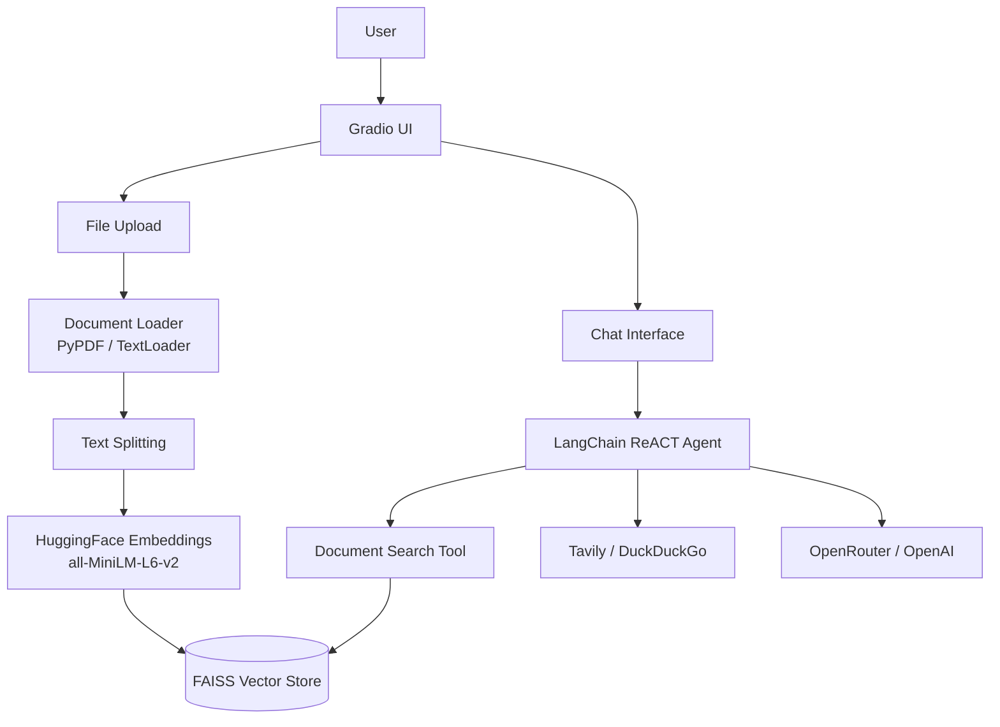

<p align="center">
  
  
  
  
</p>

# End-to-End RAG + ReACT AI Agent

A powerful AI application that combines LangChain's ReACT agent with Retrieval-Augmented Generation (RAG). Upload a document and chat with it — or ask anything using web search.

**Live Demo:** [huggingface.co/spaces/Tochiiy/End2End-RAG-ReACT-AI-AGENT](https://huggingface.co/spaces/Tochiiy/End2End-RAG-ReACT-AI-AGENT)

## Architecture



## Tech Stack

| Layer | Technology |
|-------|-----------|
| **Framework** | LangChain, LangGraph |
| **LLM** | OpenRouter (OpenAI GPT) |
| **Vector Store** | FAISS (CPU) |
| **Embeddings** | HuggingFace `all-MiniLM-L6-v2` |
| **Web Search** | Tavily API, DuckDuckGo |
| **Document Processing** | PyPDF, LangChain Text Splitters |
| **UI** | Gradio |

## Agent Tools

| Tool | Description |
|------|-------------|
| `document_search` | Semantic search over uploaded PDF/TXT (FAISS retriever) |
| `web_search` | Tavily search API for real-time web queries |
| `ddg_search` | DuckDuckGo fallback search |

## Quick Start

```bash
# Clone
git clone https://github.com/Tochiiy/End2End-RAG-ReACT-AI-AGENT.git
cd End2End-RAG-ReACT-AI-AGENT

# Install
pip install -r requirements.txt

# Set up environment
echo "OPENROUTER_API_KEY=your-key" > .env
echo "TAVILY_API_KEY=your-key" >> .env

# Run
python main.py
```

## Project Structure

```
End2End-RAG-ReACT-AI-AGENT/
├── main.py                 # Entry point
├── agent/
│   ├── agent.py            # LangChain agent builder
│   └── runner.py           # Agent execution with retry
├── rag/
│   ├── loader.py           # Document loader (PDF/TXT)
│   └── vectorstore.py      # FAISS vector store builder
├── tools/
│   ├── rag_tool.py         # Document search retriever tool
│   └── search_tools.py     # Web search tools (Tavily, DuckDuckGo)
├── ui/
│   └── app.py              # Gradio interface
├── config/
│   └── settings.py         # LLM configuration
└── requirements.txt
```

## Usage

1. **Upload a document** (PDF or TXT) — content is parsed, chunked, embedded, and indexed in FAISS
2. **Ask questions** about the document — the agent retrieves relevant sections
3. **Ask web questions** — the agent falls back to Tavily/DuckDuckGo search
4. **Get answers** — powered by OpenRouter/OpenAI with full context

The agent uses a ReACT loop with rate-limit retry logic (3 retries with 30s cooldown).
